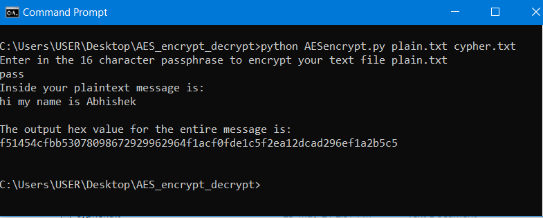
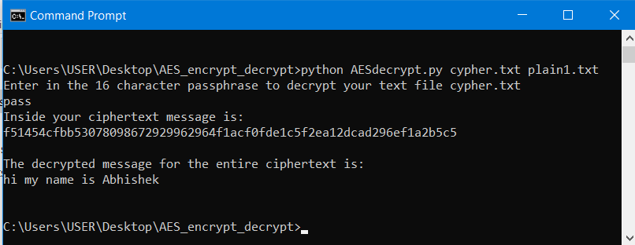

# AES-encryption-decryption
Encrypting and Decrypting text files using AES algoritm

# Description
The Advanced Encryption Standard (AES) is a symmetric block cipher chosen by the U.S. government to protect classified information. AES is implemented in software and hardware throughout the world to encrypt sensitive data. It is essential for government computer security, cybersecurity and electronic data protection.

# Contents 
Two scripts in Python to encrypt/decrypt using the 128 bits AES algorithm, ECB mode with hex "00" as padding for each character. For the encryption, an ascii plaintext file is taken as the input, then an encrypted hex file is outputted. For the decryption, a ciphertext hex file is taken as the input, then a decrypted ascii file is outputted.

# how to use
Open cmd and change directory to the project folder and then follow the steps as shown below

